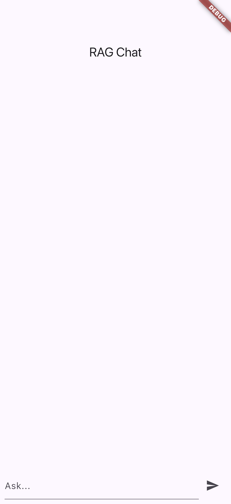
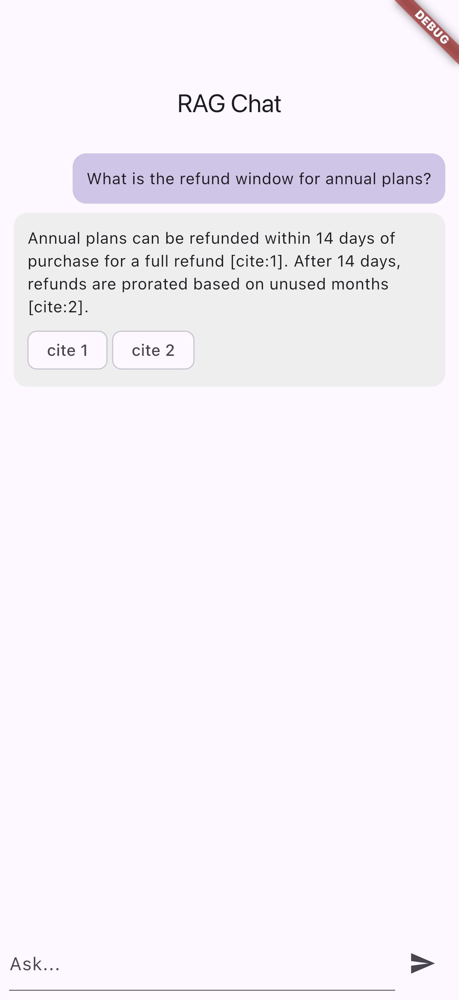
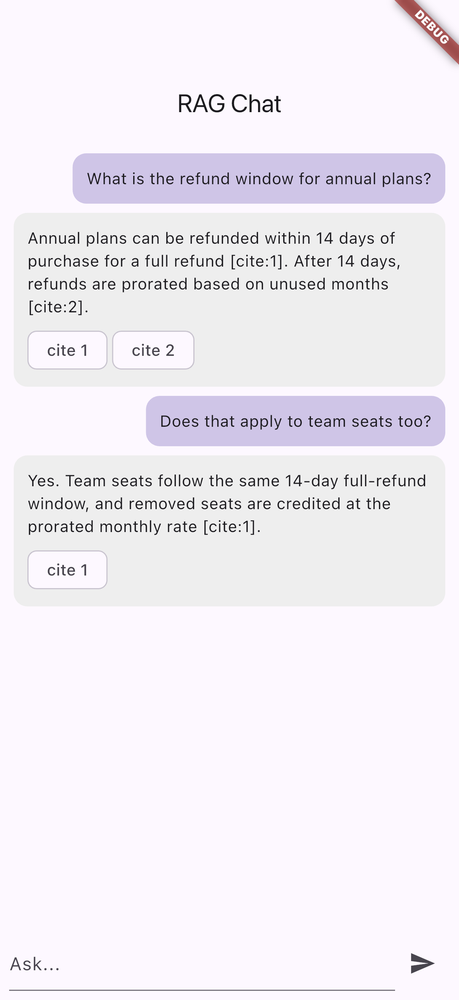
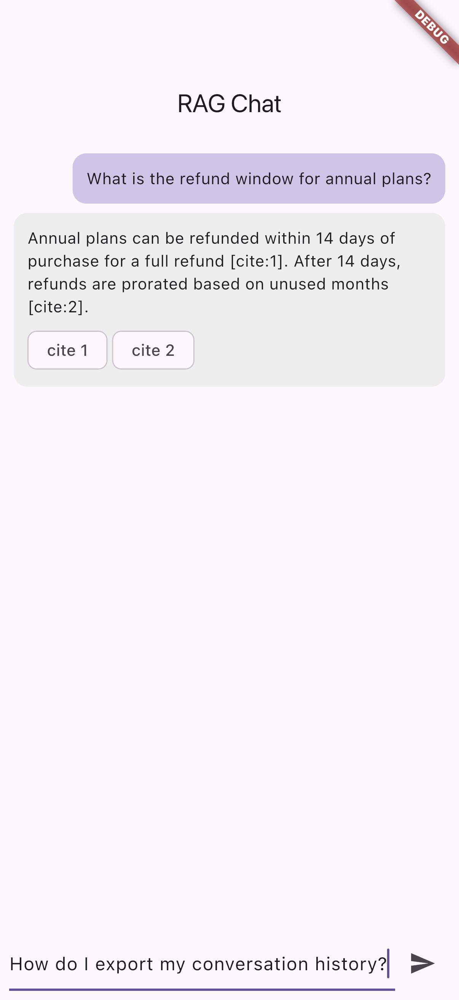

# InsightEngine - Flutter RAG Mobile (Vector Search + Claude POC)

A Flutter + Riverpod proof-of-concept that demonstrates a production-grade mobile RAG (Retrieval Augmented Generation) chatbot. The app embeds documents on-device, retrieves the top-k matches from a vector store (Pinecone-style API plus a local fallback for offline), and asks Claude to generate grounded answers with citations.

The UI is an "Airy Minimalist" research-assistant design (indigo "Obsidian Flux" light theme; Geist / Inter / JetBrains Mono type): a brand empty state with starter cards, grounded answer cards with inline citation badges and a Sources panel built from the retrieved chunks, plus answer actions and a quick-action composer.

## Demo


| Empty chat | Grounded answer | Multi-turn | Composing |
| --- | --- | --- | --- |
|  |  |  |  |

The screenshots show the real app running on an iPhone 17 Pro simulator: the first-run empty state, a grounded answer with citation chips that link back to the retrieved source chunks, a multi-turn conversation with a follow-up question, and composing a new question.

## What this POC demonstrates

- A clean RAG pipeline split into four single-purpose components: chunker, embedder, vector store, and generator
- Vector store interface with two implementations: a Pinecone REST adapter and a pure-Dart in-memory store for offline / first-run UX
- Cosine similarity retrieval with top-k and score thresholding
- Document chunking with overlap so cross-chunk context is preserved
- Anthropic Claude API integration for grounded generation with explicit citation rendering
- Streaming Claude responses surfaced through a Riverpod `StreamProvider`
- A `RagSession` orchestrator that runs `embed -> retrieve -> generate` and exposes the intermediate retrieval results so the UI can show "what did the AI use to answer this?"
- Conversation history with token-aware truncation

## Stack

- Flutter 3.x
- Riverpod 2.x for state management
- http for REST integration with Pinecone and Anthropic APIs
- crypto for embedding cache keys
- shared_preferences for conversation persistence

## Architecture

```
lib/
├── core/
│   ├── rag/
│   │   ├── chunker.dart            # Token-aware text splitter with overlap
│   │   ├── embedder.dart           # Voyage / OpenAI embeddings client
│   │   ├── vector_store.dart       # Interface + Pinecone + InMemory adapters
│   │   └── rag_session.dart        # Embed -> retrieve -> generate orchestrator
│   └── llm/
│       └── claude_client.dart      # Anthropic streaming client
└── features/
    └── chat/
        ├── chat_screen.dart        # Conversation UI with citation badges + sources
        ├── theme.dart              # Obsidian Flux design tokens (colors, type, elevation)
        └── chat_controller.dart    # Riverpod controller wiring everything
```

## How the RAG flow works

1. The user pastes or imports a document. `Chunker` splits it into ~512-token chunks with 64-token overlap.
2. Each chunk is sent to the `Embedder`, which calls the embeddings API (Voyage by default; OpenAI optional) and returns a 1024-dim vector.
3. The vectors are written to the `VectorStore`. In production this is Pinecone; the POC ships with an in-memory store that you can populate from the demo screen.
4. When the user sends a message, `RagSession`:
   a. embeds the question
   b. queries the vector store for the top 5 chunks above a similarity threshold
   c. constructs a Claude prompt with the chunks as `<context>` blocks
   d. asks Claude to answer using only the context, with `[cite:n]` markers
5. The streaming response is rendered into the chat UI with citation chips that link back to the source chunk.

## Why this matters for the job

The "AI Mobile App Developer" job calls out:
- Production AI/ML mobile apps with LLMs as a core system component
- Anthropic API integration
- Vector databases (Pinecone, Weaviate)
- RAG pipelines and embeddings workflows

This POC is exactly that pipeline, written in idiomatic Flutter with clean separation between the LLM layer, the retrieval layer, and the UI.

## Run

```bash
flutter pub get
flutter run \
  --dart-define=ANTHROPIC_API_KEY=sk-ant-... \
  --dart-define=VOYAGE_API_KEY=pa-... \
  --dart-define=PINECONE_API_KEY=...           # optional, falls back to in-memory
```
